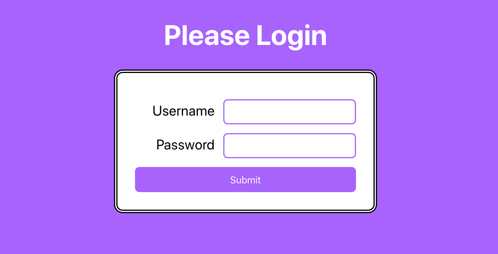

# Login Form

1. Basic HTML/CSS layout - `start` branch
1. Finished Assignment - `final` branch

### Lab #1: Create a login form that tracks the user input
1. App setup with `Create React App`
1. Create a `form` with two input fields - `username` and `password`
1. Create a Submit button for the form
1. When the text of the text fields change, the values are stored in state
1. When the Submit button is clicked, show an `alert` with the values the user entered.

Extra Credit: Make the change function such that it can be used for `n` number of fields. For example, suppose you had a form with 50 text fields. How would you create ONE function to handle the change, vs creating 50.